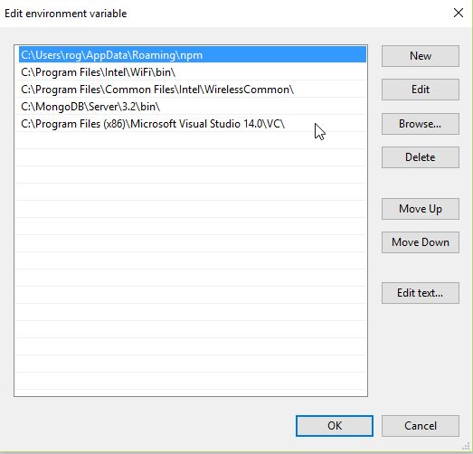
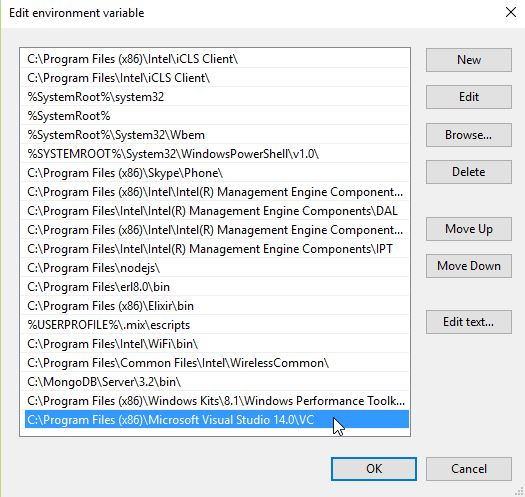

# comeonin
```
==> comeonin
could not compile dependency :comeonin, "mix compile" failed. You can 
recompile this dependency with "mix deps.compile comeonin", 
update it with "mix deps.update comeonin" 
or clean it with "mix deps.clean comeonin"
==> smode
** (Mix) Could not find the program `nmake`.
You will need to install the C compiler `nmake` to be able to build
Comeonin.

```

For this you need to install latest version of Visual studio so that C compiler `nmake` to be able to build
Comeonin.

- Install a recent version of Visual Studio (you can download the community edition). When you install Visual Studio, make sure you also install the C / C++ tools.
- After installing VS, look in the Program Files (x86) folder and search for Microsoft Visual Studio. Note down the full path of the folder with the highest version number.
- Open the run command and type in the following command (make sure that the path and version number are correct):
```
cmd /K "C:\Program Files (x86)\Microsoft Visual Studio 14.0\VC\vcvarsall.bat" amd64
```
- This should open up a command prompt, Set the environment variables.





- Navigate to you project(in the same command prompt) and run you commands

[Visual Studio](https://www.visualstudio.com/post-download-vs?sku=community&clcid=0x409&downloadrename=true)
